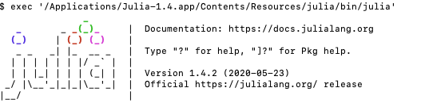
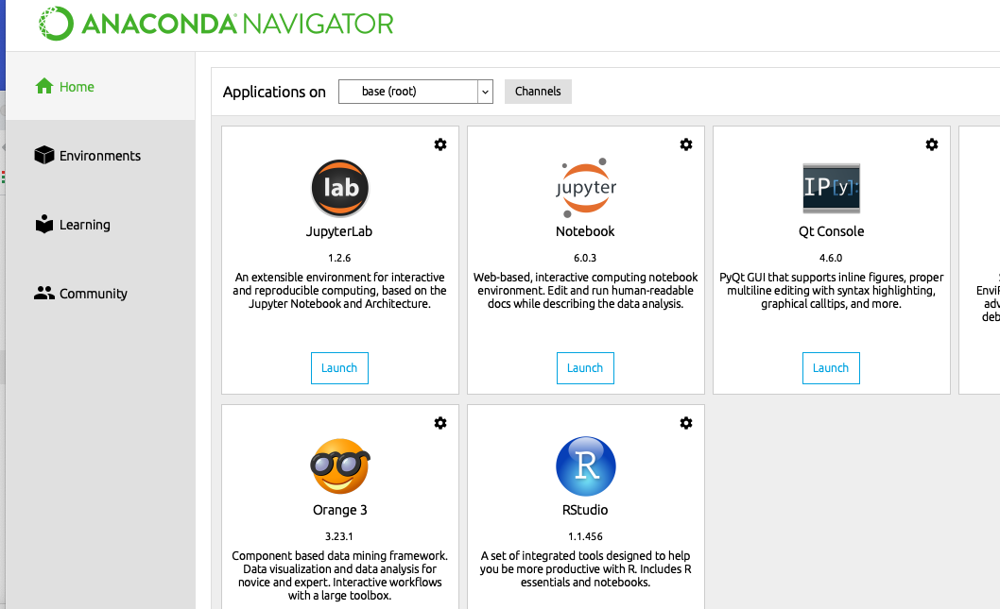

### Homework 0 - Setting Up Julia and Getting Started

Note: This will cover how to setup on macOS. If you are using Windows and are new to Terminal/Shell suggest using a Linux VM installed on your machine.

Homework 0 is just a review of the intro class. It is meant for you to reference for setting up Julia/Python/Anaconda in your enviornment. This is specifically written for those with a non-coding background to get started.

## Install Julia

1. Download [Julia](https://julialang.org/downloads/) and install it.
2. Once you have installed it, you can simply launch it from your Applications Folder on your Mac. On your first run you will see:



3. Now that you have Julia Installed you will need to add it to your Jupyter install. But before you do that, grab and install [Anaconda](https://www.anaconda.com/download/)
4. Once Anaconda is installed and before you run it, you will want to add the Julia Packages.

Run the following in the terminal window Julia launched

```
julia> using Pkg

julia> Pkg.add("IJulia")
```

This should get Julia loaded and started.

5. At this point you can open Anaconda Navigator (Spotlight is easiest)
6. Launch Jupyter



This will span a Jupyter Notebook browser window. Navigate to your cloned JuliaBoxTutorials repo and go through 00-02 in introductory-tutorials